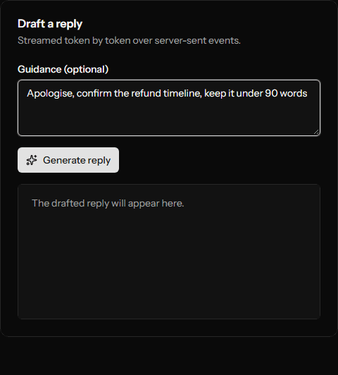
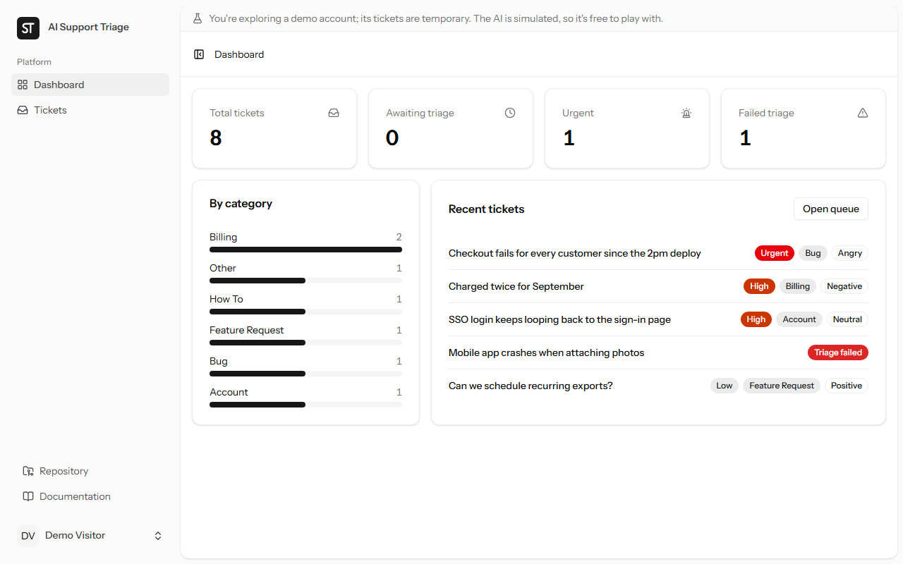
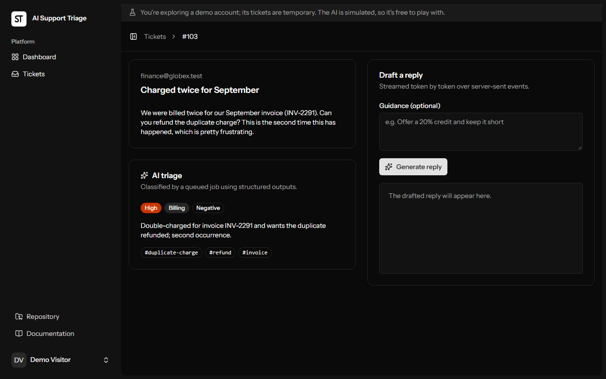

<p align="center">
  
</p>

<h1 align="center">AI Support Triage</h1>

<p align="center"><strong>Never fall behind on support again.</strong></p>

<p align="center">
  <a href="https://github.com/GodfreysDragon/ai-support-triage/actions/workflows/tests.yml"></a>
  <a href="LICENSE"></a>
</p>

<p align="center">
  <strong>Live demo:</strong> <em>coming soon</em> · no sign-up needed, click <strong>Try the demo</strong>
</p>

<p align="center">
  
</p>

A support inbox that sorts itself. Paste in a customer ticket and Claude classifies it in the
background: category, priority, customer mood, a one-line summary and tags. When you're ready to
answer, it drafts the reply live, word by word, steered by a note from you ("offer a credit, keep it
short").

Built with **Laravel 13, Vue 3, Inertia v3, Tailwind 4 and the Claude API**.

## What it does

- **Triage in the background.** A queued job asks Claude for a schema-guaranteed JSON verdict, retries
  rate limits and outages with backoff, and marks the ticket failed (with a **Retry** button) when retrying
  won't help.
- **Streaming reply drafts.** The draft streams over server-sent events. Stop it halfway, restore the last
  finished draft, regenerate with new guidance, copy it out. Only a finished draft is ever saved.
- **A dashboard** of what needs attention: totals, urgent and failed tickets, a category breakdown and the
  latest tickets.

| Dashboard (light)                                            | Ticket and triage (dark)                                                     |
| ------------------------------------------------------------ | ---------------------------------------------------------------------------- |
|  |  |

## Try it locally (2 minutes, no API key)

```bash
git clone https://github.com/GodfreysDragon/ai-support-triage.git
cd ai-support-triage
composer setup          # install, .env, app key, migrations, frontend build
composer run dev        # web server + queue worker + Vite
```

Open the app and click **Try the demo**: you get your own throwaway account with eight sample tickets.
The default `fake` driver classifies with keyword rules and streams a canned reply, so everything works
offline and for free. To use the real model, set this in `.env`:

```dotenv
AI_DRIVER=claude
ANTHROPIC_API_KEY=sk-ant-...
ANTHROPIC_MODEL=claude-opus-5-5
```

> **Windows:** PHP's built-in server can't run several workers there, so a reply stream blocks the page's
> polling until it finishes. Serve the app through [Herd](https://herd.laravel.com) (or any php-fpm setup)
> instead of `php artisan serve`.

## Deploy (free, on Render)

The repo includes a [Render Blueprint](render.yaml) and a production [`Dockerfile`](Dockerfile).
In the Render dashboard choose **New → Blueprint**, pick this repository and confirm. That's it: the
free web service builds the image, generates `APP_KEY`, creates and migrates SQLite at boot, and runs
the demo on the fake driver. A [`docker` workflow](.github/workflows/docker.yml) builds the same image
on every pull request and smoke-tests it, including Try the demo and a streamed reply.

The free plan sleeps after 15 idle minutes (the next visit takes about a minute to wake it) and resets
its disk on restart, which suits throwaway demo accounts.

## Engineering highlights

| Concern                               | How                                                                                     |
| ------------------------------------- | --------------------------------------------------------------------------------------- |
| Schema-guaranteed JSON from the model | Structured outputs built from PHP enums (`app/Ai/Data/TriageResult.php`)                |
| Slow AI work off the request path     | Queued `TriageTicket` job; only transient errors retry (`isTransient()`)                |
| Streaming LLM output to the browser   | `response()->eventStream()` + `useReplyDraft.ts`; partial drafts are never persisted    |
| Prompt-injection boundary             | Ticket text wrapped in `<ticket>` tags; system prompts treat it as untrusted            |
| Refusals                              | Server-side fallback model, plus refusal handling mid-stream                            |
| Swappable provider                    | One `SupportAssistant` interface: Claude implementation + an offline fake               |
| Spend control                         | Per-user rate limit on every endpoint that calls the model                              |
| Prompts as reviewable text            | `resources/prompts/*.md`, assembled by `TicketPromptBuilder`                            |
| Per-user data                         | Policies on every ticket route; each demo visitor gets an isolated, auto-pruned account |
| Accessibility                         | axe-core clean (WCAG 2.1 AA) on every page, light and dark, at phone width              |

## How it works

```
POST /tickets ──► Ticket (pending) ──► TriageTicket job ──► Claude (structured output) ──► Ticket (triaged)
                                                     ▲
                    ticket page polls every 1.5s ────┘

POST /tickets/{id}/reply ──► Claude stream ──► SSE {type:"delta"} … {type:"done"} ──► reply panel appends text live
                                                                       └─► draft saved only if the stream completes
```

## Building it: decisions and lessons

**The problem.** Support teams lose time reading every ticket just to decide how urgent it is, then
writing similar replies over and over. The app does that first pass, so a person only has to review.

**Key decisions**

- **Polling instead of websockets.** A ticket is pending for a few seconds, so the page polls only while
  it's pending and stops after. No websocket server to run.
- **Server-sent events for drafts.** One-way, plain HTTP, and Laravel streams them natively. A draft is
  saved only when its stream finishes, so a stopped or refused reply never overwrites a good one.
- **A fake driver behind the same interface.** Tests, demos and local development run offline, free and
  deterministic, through exactly the code path the real model uses.
- **Retry only what can succeed.** Rate limits and outages go back to the queue with backoff; refusals and
  malformed output fail immediately with a message and a manual **Retry**.

**Bugs worth telling**

- **Restoring the wrong draft.** After a stream error, the panel restored the draft the page _loaded_
  with, not the newest finished one, because page data isn't refreshed after a stream completes. The
  composable now tracks the last finished draft itself, with a unit test that reproduces the old bug.
- **Copy silently did nothing** on the local `http://` site. Browsers only expose the clipboard API on
  HTTPS or localhost, and the automated check ran on `127.0.0.1`, which counts as secure. Fixed with a
  fallback and a visible "Copy failed" state.
- **Green locally, red in CI.** Vitest loads `vite.config.ts`, whose Laravel plugin refuses to start when
  `CI` is set. The plugin is now skipped under Vitest, with its import alias declared directly.
- **A testing tool that couldn't see streams.** Pest's browser plugin buffers responses, and Laravel
  flushes that buffer after every event, so browsers received empty streams. Streaming is covered one
  layer down instead: a feature test for the server and Vitest for the client.

## Testing

```bash
php artisan test     # Pest: unit, feature and browser tests
npm test             # Vitest: frontend unit tests
composer ci:check    # everything CI runs: format, lint, vue-tsc, Vitest, Pint, PHPStan, Pest
```

| Layer          | Where                         | Notes                                                                                                                                                   |
| -------------- | ----------------------------- | ------------------------------------------------------------------------------------------------------------------------------------------------------- |
| Unit / feature | `tests/Unit`, `tests/Feature` | No network: the fake driver, or the real SDK with a recording HTTP transport                                                                            |
| Browser        | `tests/Browser`               | Real Chromium via [Pest's browser plugin](https://pestphp.com/docs/browser-testing); needs `npm run build` and, once, `npx playwright install chromium` |
| Frontend unit  | `resources/js/**/*.test.ts`   | Vitest, run through Vite+                                                                                                                               |

## Known limitations

- **The public demo uses the fake driver,** so its triage and replies are simulated. The real model is one
  setting away (see above) and was tested by hand against the live API.
- **Streaming isn't browser-tested,** for the reason above; it's covered by feature and unit tests.
- **Single-user queues.** Tickets belong to one account; there are no teams or assignment.
- **Drafts aren't sent anywhere.** You copy the reply into your real help desk.

## What I'd build next

- Push updates with Laravel Reverb instead of polling.
- Team workspaces with ticket assignment.
- Send approved replies by email and keep a draft history.
- Track token usage and cost per ticket.
- An evaluation set to measure triage accuracy when prompts or models change.

## How AI was used

This project was built with AI pair programming. Most of the code and tests were written by
[Claude Code](https://claude.com/claude-code), an AI coding agent, working from my instructions. I set
the requirements and priorities, reviewed and merged every pull request, and tested the app by hand
against the real API. Commits it contributed to carry a `Co-Authored-By: Claude` trailer.

## Project layout

```
app/
  Ai/                    SupportAssistant interface, Claude + fake implementations, prompt builder
  Demo/                  "Try the demo" accounts and their sample tickets
  Http/                  controllers (tickets, SSE replies, dashboard, demo), requests, TicketResource
  Jobs/TriageTicket.php  queued triage with its retry policy
  Models/                Ticket status changes and scopes; User demo pruning
config/ai.php            driver, model, per-call token budget and effort
config/demo.php          demo switch, account lifetime, rate limit
resources/
  prompts/               system prompts as plain text
  js/                    Vue pages, ticket components, useReplyDraft composable
tests/                   Unit, Feature, Browser (+ Vitest next to the code it tests)
```

## License

[MIT](LICENSE)
